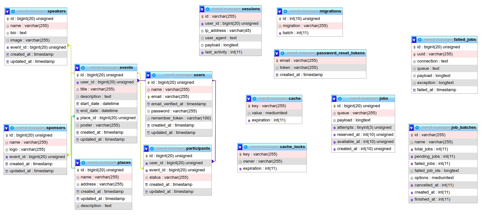

# Event Manager

## Présentation

Event Manager est un gestionnaire d'événements moderne destiné aux entreprises, écoles, centres de formation, associations, et autres organisations. Il facilite la gestion complète des événements : création, planification, gestion des intervenants, participants, sponsors, lieux, et affiches.

## Fonctionnalités

- **Authentification sécurisée** : Système de login, inscription, déconnexion et récupération de mot de passe (basé sur Laravel).
- **Gestion des événements** : Création, édition, affichage et suppression d'événements.
- **Gestion des lieux** : Ajout de lieux personnalisés pour les événements, avec gestion des adresses et descriptions.
- **Gestion des participants** : Ajout de participants à chaque événement.
- **Gestion des intervenants** : Création d'intervenants (speakers) et rattachement à des événements spécifiques, avec biographie et photo de profil.
- **Gestion des sponsors** : Ajout de sponsors et association à des événements, avec logo personnalisé.
- **Gestion des affiches et images** : Possibilité d'ajouter des images pour les affiches d’événements, photos de profils des intervenants et logos des sponsors.

## Prérequis

- **Laravel** : 12.15.0
- **PHP** : 8.2.28
- Base de données MySQL/MariaDB (conseillé)
- Serveur web (Nginx, Apache, etc.)
- Composer

## Installation

1. **Cloner le dépôt**
   ```bash
   git clone https://github.com/22101986/event-manager.git
   cd event-manager
   ```

2. **Installer les dépendances**
   ```bash
   composer install
   npm install && npm run dev
   ```

3. **Configurer l'environnement**
   - Copier `.env.example` en `.env`
   - Configurer les accès à la base de données et autres variables nécessaires dans `.env`

4. **Générer la clé d'application**
   ```bash
   php artisan key:generate
   ```

5. **Exécuter les migrations**
   ```bash
   php artisan migrate
   ```

6. **Lancer le serveur**
   ```bash
   php artisan serve
   ```

## Exemple de schéma de base de données



## Usage

- Connectez-vous ou créez un compte.
- Créez un événement, renseignez ses informations principales.
- Ajoutez un lieu, des intervenants, des sponsors et des participants à votre événement.
- Ajoutez des images pour illustrer vos affiches, profils et logos.

## Contribution

Les contributions sont les bienvenues ! Veuillez ouvrir une issue ou une pull request pour toute suggestion ou amélioration.

## Licence

Ce projet est sous licence MIT. Voir le fichier `LICENSE` pour plus de détails.

## Auteurs

- Projet développé par [22101986](https://github.com/22101986)
